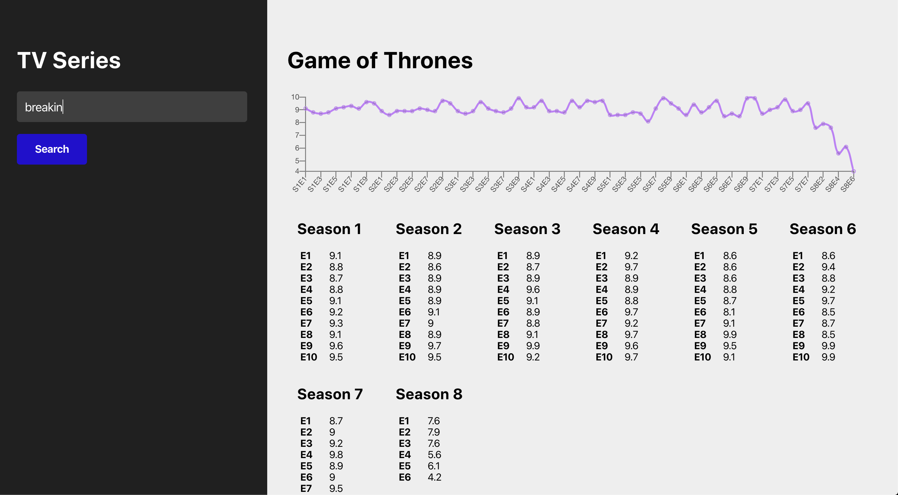
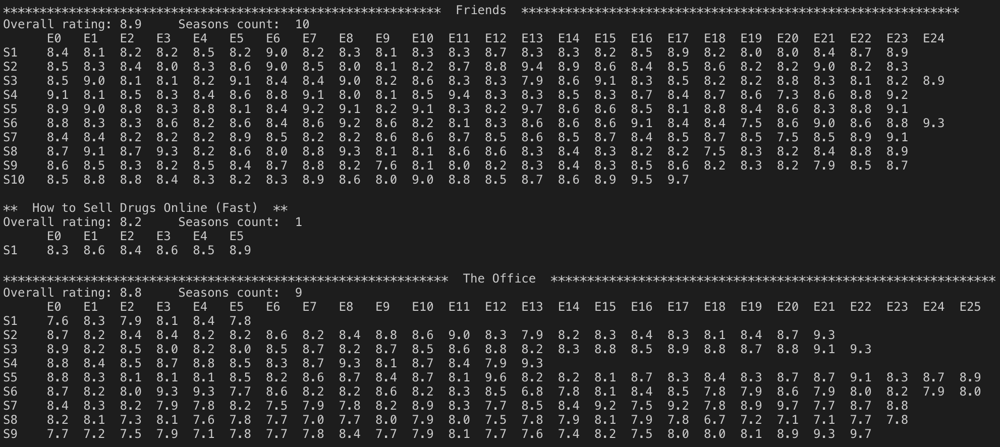

# IMDb Analyzer

A work in progress. More documentation on the way!

## Getting started

Please follow the following commands to test the application. Some of the following instructions are mac/linux specific.

Dependencies:
- [docker](https://docs.docker.com/v17.12/docker-for-mac/install/#download-docker-for-mac)
- [brew](https://brew.sh)
- [node](https://treehouse.github.io/installation-guides/mac/node-mac.html)

To start up the environment, run:

```bash
# starting up all services
docker-compose build
docker-compose up

# manually load data into the database
# during testing, we do not share a single instance of the database
cd src/service-crawler
virtualenv env
pip install -r requirements.txt
brew cask install chromedriver    # unix-only, windows cmds to follow
make run

# finally, start the web app locally
# we use the local version, not the container one,
# because there's some remaining issues with inter-container communications
cd ...        # back to the root directory
cd src/app
yarn start    # alternatively, `npm start`
```

You should be able to access the web app at [port 3000](localhost:3000) now. Try search for something now (why not Game of Thrones?).

Note that port 3000 points to the local instance of the app; to access the dockerized instance, access port 3001.

## Visuals

**UI**


**CLI**

